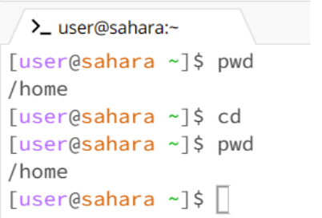
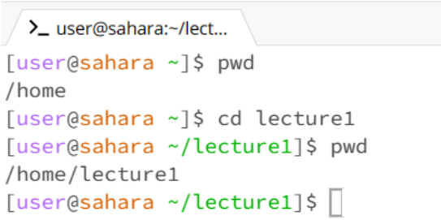
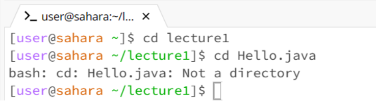
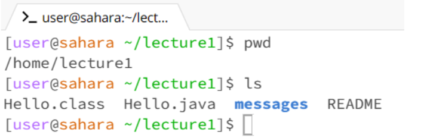
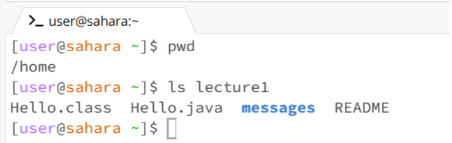
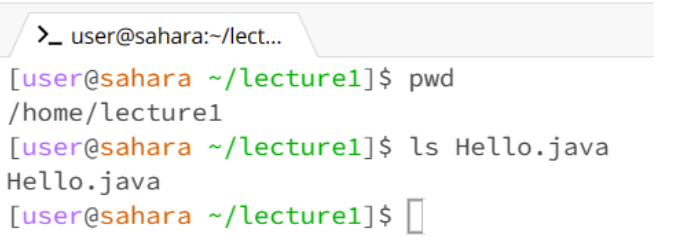
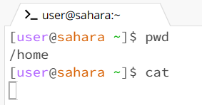
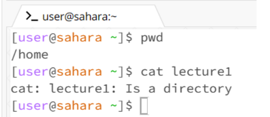

## Nathan Paguio - Lab Report 1
**Command:** `cd`

**Using** `cd` **with no argument:**

Working directory when command ran: `/home`

After entering `cd` into the terminal with no arguments, there was no output produced, indicating that the program ran successfully. But after checking the working directory, the working directory after the command ran was the same as before the command ran, because there was no argument alongside `cd`, so the directory was not changed at all.

**Using** `cd` **with the argument being a path to a directory:**

Working directory when command ran: `/home`

After I entered `cd` into the terminal with the argument `lecture1`, there was also no output produced so the command ran successfully and this was not an error. But I had checked the working directory after, and instead of `/home` it was `/home/lecture1`. Although there was no output produced, the working directory changed which can be seen in the text before where I was able to type, where instead of `[user@sahara ~]$` it was `[user@sahara ~/lecture1]$`.

**Using** `cd` **with the argument being a path to a file:**

Working directory when command ran: `/home/lecture1`

After entering `cd Hello.java` into the terminal, using cd with the argument of a path to a file, I received the output `bash: cd: Hello.java: Not a directory.` Since `cd` doesn’t produce an output when it runs correctly, this was an error as the given output was an error message. `cd` is also supposed to be used to change directories, not to access files or move between them, thus producing the given output and being an error.

**Command:** `ls`

**Using** `ls` **with no argument:**

Working directory when command ran: `/home/lecture1`

Once I entered `ls` into the terminal without an argument, I got the output `Hello.class Hello.java messages README` in my terminal. As `ls` is supposed to show the names of what the directory contains, I was shown the 4 parts of the `lecture1` directory, being `Hello.class`, `Hello.java` and `README`, all being files, while messages was in bold blue due to it being a folder. Since `ls` worked as intended, this was not an error.

**Using** `ls` **with the argument being a path to a directory**

Working directory when command ran: `/home`

I had received the output `Hello.class Hello.java messages README`, with messages being in bolded blue. This was due to the fact that `ls` was entered with the argument `lecture1`, being the path to the `lecture1` directory. As `ls` was entered with the argument `lecture1`, the names of the `lecture1` directory’s contents were displayed as the output due to `ls` showing what’s inside the argument. Also since the `ls` program ran as intended, showing the contents of the `lecture1` directory, this was not an error.

**Using** `ls` **with the argument being a path to a file**

Working directory when command ran:

**Command:** `cat`

**Using** `cat` **with no argument**

Working directory when command ran:

**Using** `cat` **with the argument being a path to a directory**

Working directory when command ran:

**Using** `cat` **with the argument being a path to a file**

Working directory when command ran:

