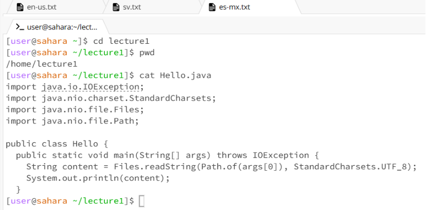

# Nathan Paguio - Lab Report 1
## **Command:** `cd` 

### **Using** `cd` **with no argument:**

 - Working directory when command ran: `/home`

 - After entering `cd` into the terminal with no arguments, there was no output produced, indicating that the program ran successfully and there was no error as no output is made when `cd` runs properly. But after checking the working directory, the working directory after the command ran was the same as before the command ran, because there was no argument alongside `cd`, so the directory was not changed at all.

### **Using** `cd` **with the argument being a path to a directory:**

 - Working directory when command ran: `/home`

 - After I entered `cd` into the terminal with the argument `lecture1`, there was also no output produced so the command ran successfully and this was not an error. I checked the working directory after, and instead of `/home` it was `/home/lecture1`. This is because `cd` changes the directory of the terminal, so here it changed from `/home` to `/home/lecture1`. Although there was no output produced, the change in working directory can also be seen in the text before where I was able to type, where instead of `[user@sahara ~]$` it was `[user@sahara ~/lecture1]$`.

### **Using** `cd` **with the argument being a path to a file:**

 - Working directory when command ran: `/home/lecture1`

 - After entering `cd Hello.java` into the terminal, using `cd` with the argument being a path to a file, I received the output `bash: cd: Hello.java: Not a directory.` Since `cd` doesn’t produce an output when it runs correctly, this was an error as there was an output produced, which was an error message. `cd` is supposed to be used to change directories, not to access files or move between them, thus producing the given output and being an error.

---

## **Command:** `ls`

### **Using** `ls` **with no argument:**

 - Working directory when command ran: `/home/lecture1`

 - Once I entered `ls` into the terminal without an argument, I got the output `Hello.class Hello.java messages README` in my terminal. As `ls` is supposed to show the names of what the directory contains, I was shown the 4 parts of the `lecture1` directory, being `Hello.class`, `Hello.java` and `README`, all being files, while `messages` was in bold blue due to it being a folder. Since `ls` worked as intended, this was not an error.

### **Using** `ls` **with the argument being a path to a directory:**

 - Working directory when command ran: `/home`

 - I had received the output `Hello.class Hello.java messages README`, with messages being in bolded blue. This was due to the fact that `ls` was entered with the argument `lecture1`, being the path to the `lecture1` directory. As `ls` was entered with the argument `lecture1`, the names of the `lecture1` directory’s contents were displayed as the output due to `ls` showing what’s inside the argument. Also since the `ls` program ran as intended, showing the contents of the `lecture1` directory, this was not an error.

### **Using** `ls` **with the argument being a path to a file:**

 - Working directory when command ran: `/home/lecture1`

 - When entering `ls Hello.java` into the terminal, having `Hello.java` as the argument, the output `Hello.java` is printed as `ls` prints the name of the directory of the working directory or the directory argument. This is odd however, as entering a path to a file as the argument also works and shows only the file name, shrinking the scope of the search/output into just the specific file that is supposed to be found rather than the all of the file names in a directory. As `ls` works as it’s supposed to, outputting the name of a certain directory/file, this is not an error.

## **Command:** `cat`

### **Using** `cat` **with no argument:**

 - Working directory when command ran: `/home/lecture1`

 - When entering `cat` into the terminal with no argument, there was no output produced but instead my terminal had crashed, being unable to input any other commands after that. `cat` is used to print what's inside a file, but there was no file or path used since there was no argument alongside `cat`, thus causing the terminal to crash and being an error as `cat` was used without a file to print from.

### **Using** `cat` **with the argument being a path to a directory:**

 - Working directory when command ran: `/home`

 - The output I had received was `cat: lecture1: Is a directory`, and this was because I had entered a directory as an argument rather than entering a file as the argument to go along with the `cat` command, showing that I was using an invalid argument for `cat`. This is an error because the given output is an error message thrown due to the use of an invalid argument with the `cat` command, as I used a directory as the argument `cat` rather than a file as intended.

### **Using** `cat` **with the argument being a path to a file:**

 - Working directory when command ran: `/home/lecture1`

 - I had received this output as this is the code inside of `Hello.java`. Since the `cat` command outputs what the argument contains, being what is inside the file, the output here was the code inside of `Hello.java`. This is not an error as the `cat` command worked as intended.

