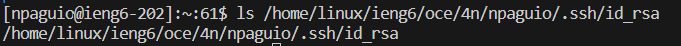
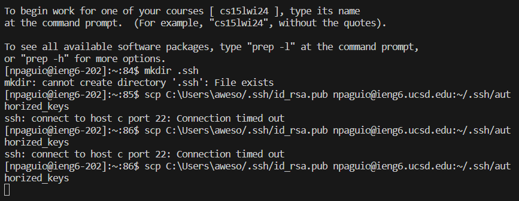

# Nathan Paguio - Lab Report #2

## Part 1:
## ChatServer code:
```
import java.io.IOException;
import java.net.URI;

class Handler implements URLHandler {
    String groupChat = "";
    public String handleRequest(URI url) {
        if (url.getPath().equals("/")) {
            return groupChat;
        } else {
            if (url.getPath().contains("/add")) {
                String[] parameters = url.getQuery().split("=");
                String[] getUser = parameters[1].split("&");
                    groupChat += (parameters[2] + ": " + getUser[0] + "\n");
                    return String.format(groupChat);          
            }
            else{
            return "404 Not Found!";
            }
        }
    }
}

class ChatServer {
    public static void main(String[] args) throws IOException {
        if(args.length == 0){
            System.out.println("You don't have a port number! Try any number between 1024 to 49151");
            return;
        }
        int port = Integer.parseInt(args[0]);
        Server.start(port, new Handler());
    }
}
```

In my code, the only method called after using `/add-message` was `handleRequest()`. There are no arguments that the method explicitly takes in, however the `Handler` class has a field called `groupChat`, which is a String object which contains all of the chat messages sent in a server, similar to how a text file would be treated in this context.

Once the `handleRequest()` method is called after using `/add-message`, the path is split into 3 different Strings due to the path for adding a message. `groupChat` is affected where using `/add-message` with the proper formatting will result in the intended behavior of the last String being the username and the 2nd String being the message the user is sending (based on testing/debugging, the 1st String is `/add-message`). After each instance of `/add-message` occuring, the message created from the path is concatenated into the groupChat String with `”\n”` at the end of the message for a line break, giving each message its own line rather than having all of the messages be on the same one.

## Part 2:

### Absolute path to public key:


### Absolute path to private key and terminal interaction without being asked for a password:
- I had tried to redo the process of using `scp` and copying my public SSH key into my ieng6 accout so I wouldn't be asked for a password whenever I logged onto my remote account using `ssh`, but had failed to do so after following the directions in the Week 3 lab writeup. I plan on working on this in the future and fixing this for my resubmission, even attending office hours to get some help.
  


## Part 3:
In weeks 2 and 3, I didn’t know how to set up a server and how to log into the school computers through another terminal, whether it was from Edstem or on VSCode on my own computer. It was pretty interesting seeing this all play out and actually work on this rather than using an app or a website to do that. With the server setup, I didn’t know that we could use our web browser and our own computers to create servers and test our code for them, like using `localhost:___`, as well as using `ssh` to log into one of the ieng computers. Also, it was nice to see how code made on a workspace like Edstem or VSCode could be seen in action with `localhost` and creating servers on the ieng computers so our classmates could access our code and interact with it, like incrementing numbers as seen in Week 2's lab, as well as creating a server similar to a chatroom in this lab report with skills learned from weeks 2 and 3.
