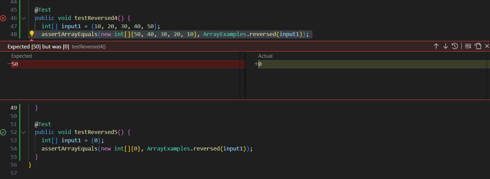

# Nathan Paguio - Lab Report 3

## Part 1:

### Failure-inducing Input:

```
@Test
public void testReversed4(){
  int[] arr = new int[]{10, 20, 30, 40, 50};
  assertArrayEquals(new int[]{50, 40, 30, 20, 10}, ArrayExamples.reversed(arr);
}

```

### Input that doesn't induce a Failure:

```

@Test
public void testReversed5{
  int[] arr = new int[]{0};
  assertArrayEquals(new int[]{0}, ArrayExamples.reversed(arr);
}

```

### Symptom:



### Program before Fix:

```

static int[] reversed(int[] arr) {
  int[] newArray = new int[arr.length];
  for(int i = 0; i < arr.length; i += 1) {
    arr[i] = newArray[arr.length - i - 1];
  }
  return arr;
}

```

### Program after Fix:

```

  static int[] reversed(int[] arr) {
    int[] newArray = new int[arr.length];
    for(int i = 0; i < arr.length; i += 1) {
      newArray[i] = arr[arr.length - i - 1];
    }
    return newArray;
  }

```

### Explanation:

The fix in this code works as originally, the argument array was being altered with values from the new array being made earlier in the method. Due to this, the argument array would be returned with all of its values being 0, as it copies from a new array with all of its values being 0 and having the same length as the argument array. With the fix, instead of the argument array being returned, the new array as returned and is being altered with the argument array's values, copying over those values to the new array (through `newArray[i] = arr[arr.length - i - 1]`, newArray's value at i would be set to arr's value at the opposite index, ex. the values at indices 1 and 4 switch values) such that the values would be arranged where it would be in the reversed order of the original argument array as intended.

## Part 2:
## Researching Commands:

 - For my command, I decided to research the `find` command.
