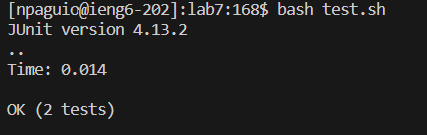

# Nathan Paguio - Lab Report 4

### Step 4:
\
Keys Pressed: `<up>`, logging into my ieng6 account with `ssh` was 1 in my history so I just pressed the up arrow for it.

### Step 5:
\
Keys Pressed: `git clone https://github.com/npaguio/lab7`, I didn’t think this set of commands was in my history so I just typed it out.

### Step 6:
\
Keys Pressed: `bash test.sh`, similar to step 5 I just typed it in since I didn’t recall having it in my history. I also just used `bash test.sh` since I noticed this in the repository at first, so I felt this would be better and save more time compared to using `javac -cp` and compiling the files that way.

### Step 7:
\
Keys Pressed: `vim ListExamples.java ?index2 <enter> <e> <i> <right> <backspace> <2> <esc> :x`, using the shortcuts from `vim tutor` I just followed them to go directly to the last `index2` appearance in `ListExamples.java`, which was where I needed to edit the file to fix the tests. I then pressed `<right>` and `<backspace>` to change `index1` to `index2`, then `:x` was to save the file.

### Step 8:
\
Keys Pressed: `<up> <up> <up> <up> <up> <up> <up>`, `bash test.sh` was 7 in my history so I just used the up arrow.

### Step 9:
\
Keys Pressed: `git add ListExamples.java git add ListExamplesTests.java`, I just typed this out since I didn't remember having it in my history like with step 4, or at least these commands would be very far behind in my history to the point it would be faster to just type out these commands individually.

