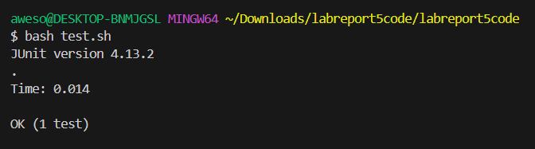

# Nathan Paguio - Lab Report 5

## Part 1:

#### Student: So I've been having a problem with my `NumPattern.java` code and I don't know why it's failing. I've looked over the code a few times after forking it but I probably can't think at the moment, I sent a screenshot of my symptom below. Looking at it, I believe that I'm not adding the right number values to my `List<Integer>` object that's being returned, following a different pattern to what I expected.


#### TA: Alright, looking at your symptom, try looking at the method in `NumPattern.java` that's being called in your tester file and see if there are any mistakes in what's being added to the return array. Hope that helps!

#### Student: I tried that and saw that I wasn't updating one of my variables properly, so instead of adding the next integer that's supposed to be in the array, my method would just follow the pattern of adding 2 or 4 to the first element, being the same 2 numbers aside from the original number. In this case, my number pattern array was `{1, 3, 5, 3, 5}` instead of `{1, 3, 7, 9, 13}`. Here's a screenshot of the test working in my terminal, thank you so much for helping me out!



### Setup Information:
The files used were `NumPattern.java`, `NumPatternTests.java`, and a `test.sh` file that compiled what was necessary to use `NumPatternTests.java` (ex. JUnit, `NumPatternTests.java` itself). The directory was `Downloads/labreport5code/lab5report`.

#### File Contents Before Bug Fix (`NumPatternTests.java` and `test.sh` were not edited at all when fixing the bug):
`NumPattern.java`:
```
import java.util.ArrayList;
import java.util.List;

class NumPattern {

  static List<Integer> pingPong(Integer base) {
    List<Integer> result = new ArrayList<Integer>();
    result.add(base);
    for(int i = 1; i < 5; i++){
      if(i%2 != 0){
        result.add(base + 2);
      }
      if(i%2 == 0){
        result.add(base + 4);
      }
    }
    return result;
  }

}

```


## Part 2:
